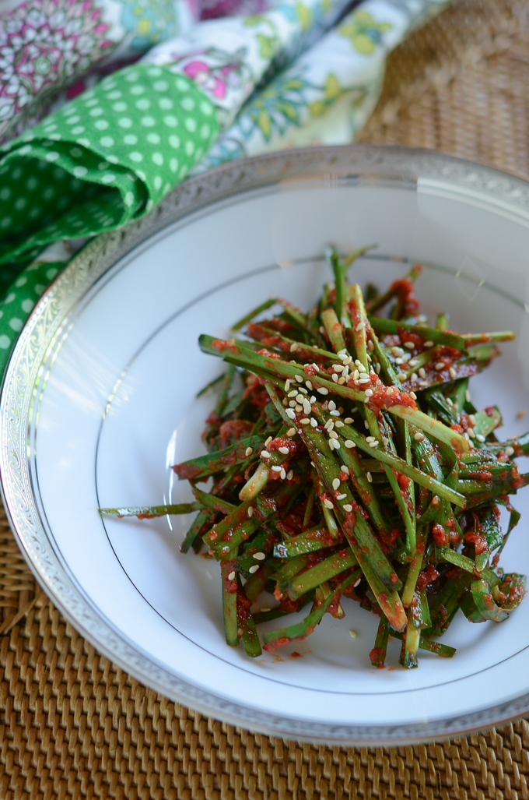

[Follow us on Instagram!](https://www.instagram.com/hongrys.atx/)

# History

Hidden within one of Austin's unique East Side neighborhoods, Hongry's Kitchen is a Speakeasy Omakase KBBQ restaurant that serves a variety of meats and farm to table organic vegetables.

Founded in 2019, we are family owned and operated proudly in Austin, TX.

## June 2, 2022 - ForeFlight Catering

### LA 갈비 (LA Galbi)
> "Galbi" is the Korean word for "rib", and the dish is usually made with beef short ribs. "LA Galbi", also known as a flanken cut, features cut bones peeking out along the long edge. The method was developed by Korean immigrants in Los Angeles to accommodate the thinner rib-eye cut preferred by American butchers. The variation, which enables the marinade to penetrate the meat faster, has since made its way back to South Korea.

---

### 김치 (Kimchi)
> A traditional Korean side dish of salted and fermented vegetables, such as napa cabbage and Korean radish. A wide selection of seasonings are used, including gochugaru (Korean chili powder), spring onions, garlic, ginger, and jeotgal (salted seafood), etc.

---

### 깻잎 (Kkaennip)
> In Korean cuisine, kkaennip or perilla leaves are widely used as a herb and a vegetable. Kkaennip can be used fresh as a ssam vegetable, fresh or blanched as a namul (edible leaves), or pickled in soy sauce or soybean paste to make jangajji (pickle) or kimchi.

---

### 부추 (Buchu)
> Known as buchu (부추), garlic chives are widely used in Korean cuisine. They can be eaten fresh as namul, pickled as kimchi and jangajji, and pan-fried in buchimgae (pancake). They are also one of the most common herbs served with gukbap (soup with rice), as well as a common ingredient in mandu (dumplings).

---

### 쌈장 (Ssamjang)
> Ssamjang is a thick, spicy paste used with food wrapped in a leaf in Korean cuisine. The sauce is made of doenjang (fermented soybeans), gochujang (red chili paste), sesame oil, onion, garlic, green onions, and optionally brown sugar.

---

[Follow us on Instagram!](https://www.instagram.com/hongrys.atx/)